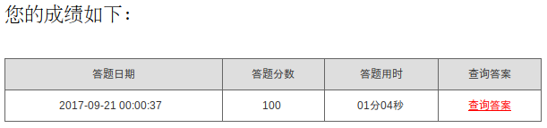

# dang知识问卷自动解答机
>仅适用于广东的网考生，千万不要拿来做坏事，也不要太过分了哦，会查水表的。

### 算法过程
[答题网站首页](https://ks.gdycjy.gov.cn/index.jsp)

**第一步**

注册若干个伪造的考生，采用随缘解答法进行答题，注册过程中可以使用[pytesseract](https://pypi.python.org/pypi/pytesseract)直接识别验证码，但是由于识别不出简单的数字验证码，所以就放弃使用自动验证的步骤，所以如果要伪造用户，就需要一个一个地手动输入验证码了。

**第二步**

几个伪造的用户提交了各自的答卷后会有各自的答案解析，错误的题目会有提示，所以我们只需要利用这个规则对题目进行排错，并把所有题目保存在本地题库即可。

**第三步**

经过上面一步撞库，把标准答案保存在本地。输入你的真实姓名、手机号码和身份证号码进行答题即可。不同组织机构需要修改组织名。

### 使用方法
- 打开main.py文件，需要设置FAKE\_USER\_NUM、AREA\_NAME、CITY\_NAME、UNIT\_NAME、SUBUNIT\_NAME。

- 左上角弹出验证码，手动输入验证码。

- 直接运行main.py文件，按指示输入即可，要注意姓名必须2～3个字的汉字，电话号码必须符合电话号码格式，身份证号码必须符合身份证生成规则。

> python main.py   

### 运行截图
> 最后一点，由于是爬虫系统，所以代码很可能在一段时间后就不适用原来的网站了，可能需要稍作修改。

