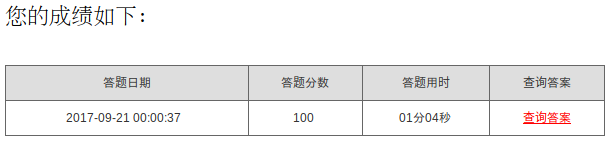

# dang知识问卷自动解答机
>仅适用于广东的网考生，千万不要拿来做坏事，也不要太过分了哦，会查水表的。

### 算法过程
[答题网站首页](http://ks.gdycjy.gov.cn/index.jsp)

**第一步**

注册若干个伪造的考生，采用[随缘解答法](http://wade.leanapp.cn/todos)进行答题，注册过程中本来是准备用[pytesseract](https://pypi.python.org/pypi/pytesseract)直接识别验证码，但是由于作者比较菜用不好，总是识别不出简单的数字验证码，所以就放弃使用自动验证的步骤，所以如果要伪造用户，就需要一个一个地手动输入验证码了（怪我咯）。

**第二步**

几个伪造的用户提交了各自的答卷后会有各自的答案解析，答案解析上会附有标准答案（为了让我们学习进步也是用心良苦），所以我们只需要用这几个伪用户去爬取到对应的题库和答案就可以了。由于网站比较简单，题目也设的很少，但是更新了查看答案的方式，需要20个以上伪造的用户才可以覆盖所有题目，并把题库保存在本地。

**第三步**

经过上面一步撞库，把标准答案保存在本地。输入你的真实姓名和手机号码进行答题，100分都是秒秒钟的事。目前默认是华工的学生，如果有需要，会更新适用范围（或者自己手动更改学校类别号）。

### 使用方法
- 打开main.py文件，需要设置FAKE\_USER\_NUM。由于生成伪用户需要花一定时间，所以提供了现成的伪用户ID FAKE_USERS，不过可能一段时间就会失效

- 左上角弹出验证码，手动输入验证码（如果有好的识别库请联系[作者](http://weibo.com/u/2310658484)或者发邮件到[hwade_good@163.com]）。

- 直接运行main.py文件，按指示输入即可，要注意姓名必须2～3个字的汉字，电话号码必须符合电话号码格式。
> python main.py   

### 运行截图
> 最后一点，由于是爬虫系统，所以代码很可能在一段时间后就不适用原来的网站了，可能需要稍作修改。

